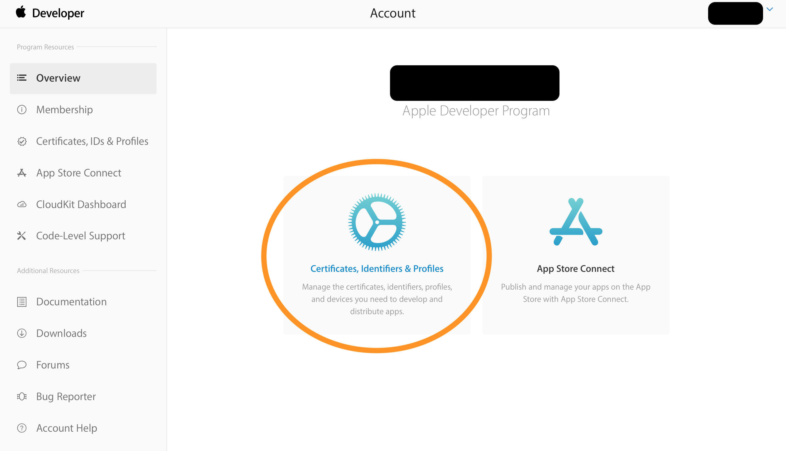
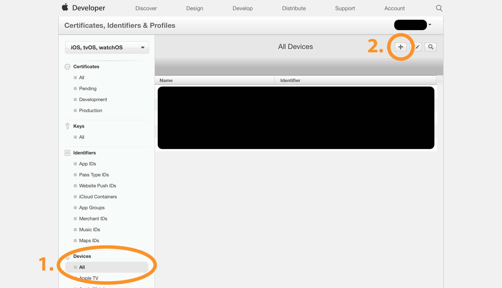
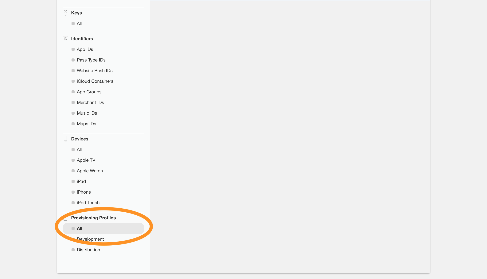
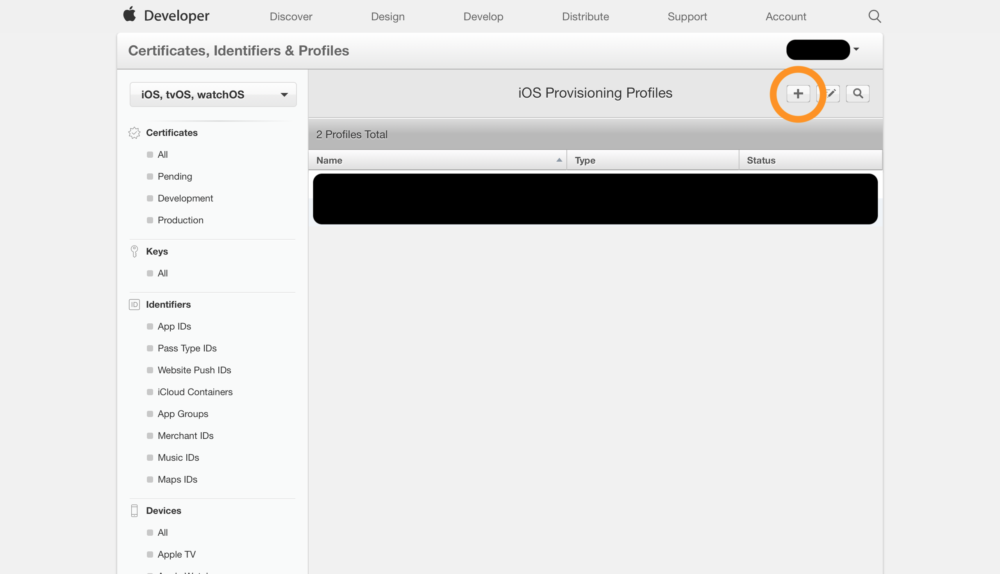
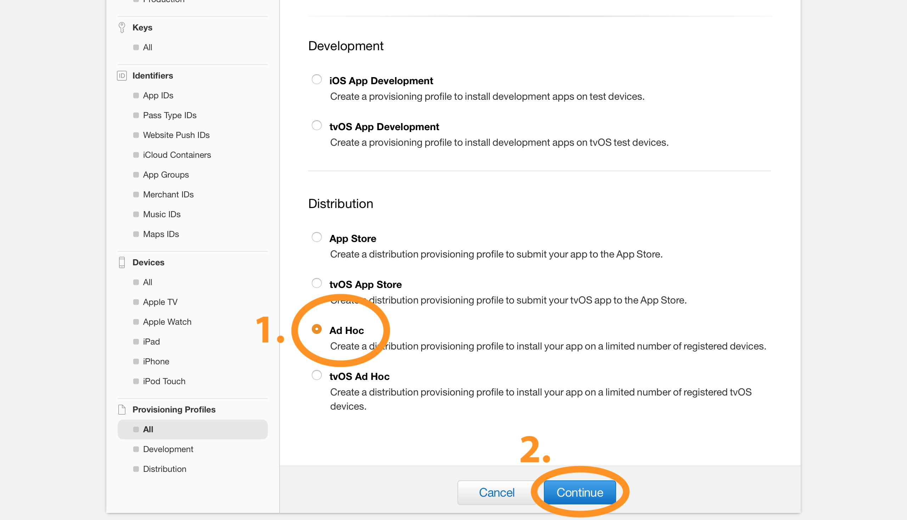

# iOS Ad-Hoc Distribution Using Firebase Hosting and Storage
Full guide on how to do Ad Hoc distribution for your iOS app using Google's Firebase Hosting and Storage

## Why Ad-Hoc?
Beta testing your iOS app can be done in many ways. A few of the most common methods are:
* Direct Deployment (via Xcode)
* TestFlight
* Ad-Hoc Distribution

Direct deployment is great if you know your testers personally and can easily meet up with them and connect their devices to your computer. Even in this case though, you will have to arrange another meeting if any changes are made to the app. Usually this testing method is only suitable for yourself, or for cases where updates are not common.

TestFlight is an excellent option, and greatly simplifies this entire process, but it has one main negative: Your app must pass the approval process for the App Store. For many, this isn't much of an obstacle, but for me, with a very rudimentary app that is far from complete, this obstacle was signifcant enough to deter me from TestFlight (for these early stages).

Ad-Hoc distribution has the remote deployment benefits of TestFlight, without the approval process requirement. It allows you to deploy your app to anyone in the world, provided they do a few small (one time) steps to send you information about their device. Delivering updates is also very straightforward.

## Why Firebase?

For me, I have no direct hosting capabilities, and I was already using Firebase in my project, so Firebase Hosting was a perfect solution for hosting a website, and Firebase Storage was a perfect solution for storing files on a server. AWS could achieve similar things, of course, but I found the APIs for AWS to be much less friendly.

## Requirements
1. Apple Developer Account (Paid)
2. Xcode
3. Firebase Project [(start here)](https://console.firebase.google.com)

## Background

This guide will accomplish the steps detailed on [this page](https://help.apple.com/deployment/ios/#/apda0e3426d7). I found it very helpful, but not completely clear on the full implementation.

## Setup

### Firebase

We will be using the [Firebase Admin Python SDK](https://github.com/firebase/firebase-admin-python) as well as the [Firebase Hosting API](https://firebase.google.com/docs/hosting/).

Follow the steps [here](https://firebase.google.com/docs/admin/setup) to set up the Python SDK.

As one of the steps in the link above, you will generate a service account key. This needs to be placed in the same directory as the provided python program for it to run (or you can modify the python program to look for the key in a different location).

Never share this key with anyone or post it anywhere. Anyone with access to it has complete control over your Firebase project.

---

To set up Firebase Hosting, you will need to perform the steps on [this page](https://firebase.google.com/docs/hosting/quickstart). I recommend doing this in your own folder within the project directory. This will generate a firebase.json file and a "public" folder containing a placeholder HTML file for your website.

For my website, I simply modified the generated HTML file to have a single button which installs the app. That HTML file is included in the repo as index.html (with a placeholder link instead of the actual link). I will explain more about that file later.

### Python

You will need to edit *prepareImages.py* and *prepareDeploy.py* to have the correct Firebase bucket name (replace "bucket-name" with your actual bucket name). You can either use the default bucket, or specify a custom bucket. Find more information about this [here](https://firebase.google.com/docs/storage/admin/start).

You must also replace "app-name" in *prepareDeploy.py* with your desired app name. This must match the app-name specified later in the guide.

### Apple Developer Portal

Before deploying your app, you will need to do two things in the developer portal:
1. Add test devices
2. Generate an Ad-Hoc provisioning profile with those devices included

These steps will need to be repeated every time you add new testers. For details on these steps, see the following two sections.

## Adding Test Devices

### Obtaining the UDID of devices

Adding test devices will be done using the UDID of the device. So, before you can add a user's device, they will need to obtain its UDID.

This can be done using either iTunes or Xcode. Assuming the user is remote, iTunes is likely the easier option, because many people already have it installed. Follow [these](https://bjango.com/help/iphoneudid/) steps to find the UDID of a device in iTunes.

If the user does have Xcode, or you are able to meet them in person and connect their device to your computer, the UDID can be easily found in Xcode by connecting the device and navigating to Window->Devices and Simulators. Then, the UDID will be displayed after the label "Identifier" when you select the device.

As with the service account key, do not share your UDID or the UDIDs of any of your testers with anyone. Doing so could allow illegitimate apps to be installed to those devices.

### Adding devices

Once you have the UDID of the device(s) in question, you are ready to add them to your developer account.

Navigate to https://devloper.apple.com and log in.

Then, follow these steps to add a device:

1. 

2. 

## Generating an Ad-Hoc Provisioning Profile

Once you've added devices, you can create a provisioning profile with those devices included. This is done in the same area of the developer portal as the device adding:
1. 

2. 

3. 

4. 

After that point, the steps should be straightforward. Once finished, make sure to download your new provisioning profile.

## Deploying Your App

Once your users are added and your provisioning profile has been created, you are ready to deploy your app.

### Steps

#### Preparing images

You must have two images prepared before deploying your app. They will determine what your app icon looks like once the app is installed to someone's device. They must be 57x57 and 512x512. I have provided black placeholder images with these sizes.

Once you have your images, run *prepareImages.py*:

`python prepareImages.py`

(images must be in the same directory as *prepareImages.py*)

This will upload these images to Firebase Storage and make them public so that you can use the same links to access them every time. This makes the following steps much smoother.

NOTE: If you do not need to change the images before deploying, you will only need to do this step once.

#### Xcode

1. Archive your app by going to Product->Archive
2. Navigate to your archive via Window->Organizer
3. Select your archive and click Distribute App
4. Choose Ad-Hoc as the distribution method
5. Edit the distribution options as desired. Make sure to check "Include manifest for over-the-air installation"
6. Enter links for the ipa and images.

For this step, you must provide links to three files. Enter the following links:

1. https://storage.googleapis.com/bucket-name.appspot.com/AdHoc/app-name.ipa
2. https://storage.googleapis.com/bucket-name.appspot.com/512.png
3. https://storage.googleapis.com/bucket-name.appspot.com/57.png

Replace app-name in the first link with whatever you wrote in the "Name" field above all the link fields.

You can choose anything for app-name. Just make sure you are consistent and use the same app-name when editing *prepareDeploy.py*

You can find your bucket-name by navigating to https://console.firebase.google.com and clicking on Develop (if not selected) and then Storage. It should display gs://bucket-name.appspot.com at the top and if you ran *prepareImages.py* earlier you should also see two images in a list.

Note that you have not uploaded your .ipa file yet, so that link will not work if you click on it. This is expected.

7. Choose "Manually manage signing"
8. Select the signing certificate you used to create your Ad-Hoc provisioning profile, and then select the downloaded provisioning profile
9. Once finished, click Export
10. When prompted where to export the archive, choose the archives folder in this repo's folder. You may choose another folder, but then you will have to edit *prepareDeploy.py* to look in that folder instead.

#### Python

NOTE: *prepareDeploy.py* will look in the "archives" folder, find the latest archive, and upload files from that archive to your bucket. If you would rather have it directly upload files from known file locations, the file can easily be edited to do that. Look at *prepareImages.py* for an example of this.

11. Navigate to the location of *prepareDeploy.py* and run it

 `python prepareDeploy.py`

#### Firebase Hosting

Your Firebase site's HTML file must contain a specifically formatted link in order for the tapping of the link to correctly install the app on a tester's device.

If using the provided HTML file, you can just edit bucket-name to be your bucket name. You can also edit the other text in this app to have your app name and any new features you might have added to the app.

If using your own HTML file, you must have a link that is formatted as follows:

`itms-services://?action=download-manifest&url=https%3A%2F%2Fstorage.googleapis.com%2Fbucket-name.appspot.com%2FAdHoc%2Fmanifest.plist`

This link must begin with `itms-services://?action=download-manifest&url=`. What follows is an encoded public link to your recently uploaded manifest.plist file. If your link includes other normally encoded characters, you will need to encode it yourself or it will not work when tapped on. I found [this site](https://meyerweb.com/eric/tools/dencoder/) helpful for encoding.

Once the HTML file is edited appropriately, you are finally ready to deploy your site!

If you followed the steps for setting up Firebase Hosting earlier, you should have only one step remaining. Navigate to the folder containing your firebase.json file and public folder (which contains the index.html file you just edited) and run the following:

`firebase deploy`

Once this completes, it will print the link where your website is currently hosted. Keep this link for the next step.

## Installing Your App

If you included your own device in the provisioning profile, you can test the same installation process your testers will follow.

Simply navigate to the link provided in the last step and tap the "INSTALL APP" button (or whatever format of link you chose). If you've followed all the steps above, your app should begin installing immediately to your device!

*woot*

Now, you just need to provide this link to your testers and they will be able to install your app. You can recommend that they save it as a bookmark or a web clip on their home screen so that it is easy for them to come back to later when you make changes to the app.

Also, if you have push notifications configured for your app, you can send one out to direct them to this link every time you have a new update available.

## Conclusion

Hopefully this guide helped you out. I found this seemingly simple process to be quite annoying, and most of the links I followed to get this working for myself left out a few very important details that costed me tons of time. My hope is that this guide does not leave out any of these vital details, and saves you some time. If something looks missing or wrong, feel free to add an issue and I will get to it as soon as I can.